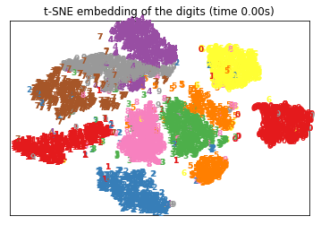
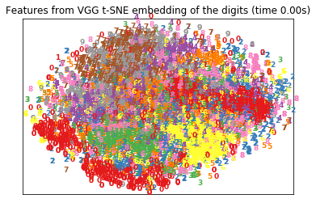

## Scattering Net vs DNN

HKUST MATH6380O Deep Learning, course project 1

Author: Kan HUANG

Date: Spring 2018

## Experiment Environments

Using 6400 of 60000 data from training set as training data. And 1960 data from 10000 data from test set as testing data. For my machine is not so good, this can save much time.

The deep learning framework is PyTorch. Using this lib to extract ScatNet features: https://github.com/edouardoyallon/pyscatwave
And this model to extract VGG19 features: https://github.com/aaron-xichen/pytorch-playground/blob/master/mnist/model.py
For both of above features, first using t-SNE to visulize them, them classify them using trained SVM.

## Results

### Features Visulization

Features from ScatNet:

Features from VGG19:

### Classifacation

Classification using SVM, applying extracted features from VGG19 network as inputs:

Test data size: (1920,)

Prediction correct count: 1281

Precision: 0.6671875

Classification using SVM, applying extracted features from ScatNet network as inputs:

(1920,)

1775

0.924479166667

## Conclusion

For VGG19 extracted feature, using SVM is not a good idea. It's better to use neural network to carry out the classification task.
